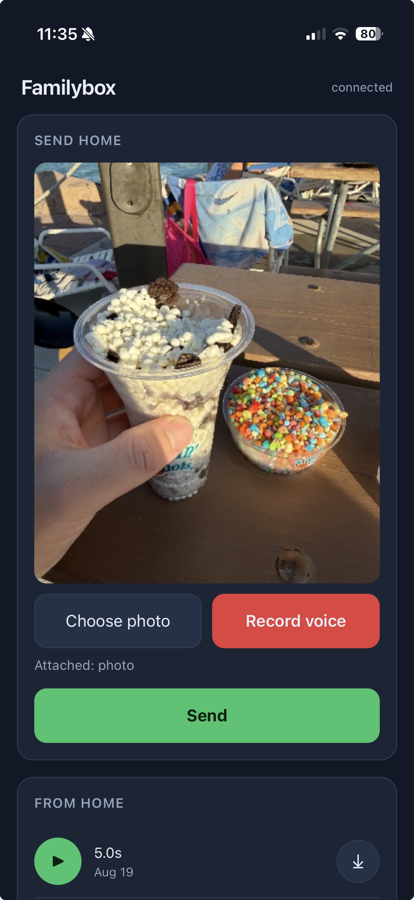
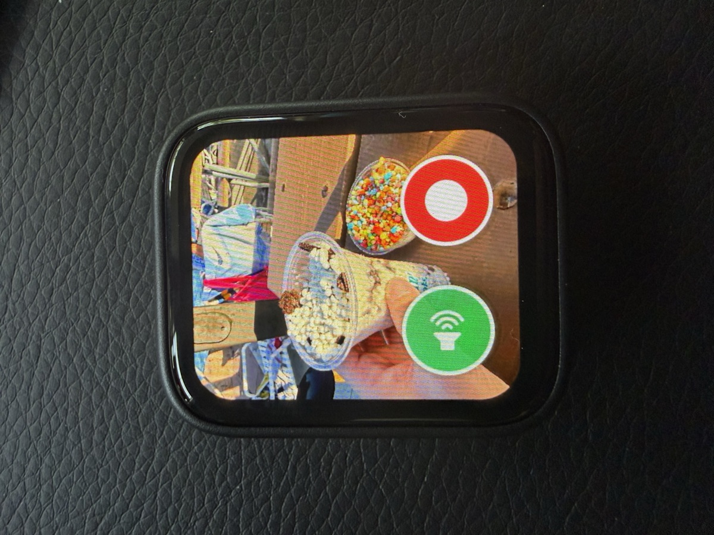

# Familybox

A photo-and-voice link between a travelling parent and a small child who
cannot read yet.

You send a photo and a voice note from your phone. It appears on a little
screen at home. The child taps a green speaker to hear you — as many times as
they like — and a red button to record a reply, which comes back to your phone.

There is no text anywhere in the child's interface.

<table>
<tr>
<td width="42%"></td>
<td></td>
</tr>
<tr>
<td align="center"><em>The parent's phone</em></td>
<td align="center"><em>The child's device</em></td>
</tr>
</table>

## Hardware

- **Waveshare ESP32-S3-Touch-AMOLED-1.8** (368x448 AMOLED, ES8311 codec with
  speaker *and* microphone, 8MB PSRAM, 16MB flash, AXP2101 PMIC)
- A machine to run the relay — a home server, NAS, or Raspberry Pi with Docker
- No SD card needed

**The board has no camera.** That is deliberate: it receives and it records,
so a child cannot broadcast video of themselves.

## How it works

```
phone (web app, added to Home Screen)
   │  HTTPS, bearer token
   ▼
relay (Docker + ffmpeg)
   │  HEIC/JPEG  -> raw RGB565, exactly 368x448x2 bytes
   │  any audio  -> 16 kHz mono WAV, loudness-normalised
   ▼
ESP32-S3 polls over HTTP on the LAN, displays, plays, records
```

**The firmware decodes nothing.** The relay does every conversion, so the
device receives bytes it can push straight at the panel and samples the codec
can play unmodified. No JPEG decoder, no audio codec, no scratch buffers.

## Setup

### 1. Relay

```bash
cp relay/.env.example relay/.env
openssl rand -hex 32          # paste into FAMILYBOX_TOKEN in relay/.env
docker compose up -d --build
curl -s localhost:8090/api/v1/health
```

Expect `{"ok":true,"messages":0}`. The relay listens on port **8090**; change
the left-hand side of the `ports:` mapping in `docker-compose.yml` if that
clashes with something.

### 2. Reaching it from your phone

The web app records audio in the browser, and **browsers only allow microphone
access over HTTPS**. The simplest way to get a real certificate on a home
server is [Tailscale](https://tailscale.com):

```bash
tailscale serve --bg 8090
tailscale serve status
```

That prints an `https://<host>.<tailnet>.ts.net` URL reachable from any of your
devices, anywhere, with nothing exposed to the public internet.

Use `tailscale serve`, **not** `tailscale funnel` — funnel would publish your
child's voice recordings to the open internet.

Open the URL on your phone, paste the token once, then **Share → Add to Home
Screen**.

### 3. Firmware

Requires **ESP-IDF v5.5.x**.

```bash
. ~/esp/esp-idf/export.sh
cd firmware
idf.py build                  # once, to generate sdkconfig
./configure.sh                # WiFi SSID/password, relay URL, token
idf.py build
idf.py -p <PORT> flash monitor
```

Find `<PORT>` with `ls /dev/cu.*` on macOS or `ls /dev/ttyACM*` on Linux.

WiFi must be **2.4 GHz** — the ESP32-S3 has no 5 GHz radio.

`configure.sh` writes your secrets into `sdkconfig`, which is gitignored. Do
not put them in `sdkconfig.defaults`, which is tracked.

## Using the device

| Control | Action |
|---|---|
| Green speaker button | Play the current voice note, repeatable |
| Red record button | Record a reply; tap again to stop (30s max) |
| BOOT button, short press | Replay the current voice note |
| BOOT button, hold ~1.2s | Show battery level and charge state |
| PWR button | Hardware power key, wired to the PMIC, not the SoC |

Up to **three** replies can be queued; they upload in the background so the
child never waits on the network. Amber dots show how many are still in flight.
A sleeping face means "on, nothing new".

## Board quirks worth knowing

These cost real debugging time and are not documented by the vendor.

- **`bsp_display_start()` produces a black screen with no errors.** The BSP
  wires LVGL through `lvgl_port_add_disp_rgb()`, which is for panels on the
  RGB/parallel interface; this board's CO5300 is QSPI, so LVGL renders and
  flushes into the void. Waveshare's own `14_lvgl_demo_v9` fails the same way,
  while `13_display_colorbar` works because it bypasses LVGL. Call
  `lvgl_port_add_disp()` directly instead — see `firmware/main/fb_ui.c`.
  `bsp_display_start_with_config()` is not a way out: it ignores the config
  you pass it.
- **Initialise the ES8311 codec before the display, with a pause between.**
  Bringing audio up after the display, or immediately before it, blanks the
  panel. See the comment in `familybox_main.c`; do not "tidy" that ordering.
- **LVGL's builtin allocator starves the display driver.**
  `CONFIG_LV_USE_BUILTIN_MALLOC` takes 64KB of internal RAM and
  `LV_ATTRIBUTE_FAST_MEM_USE_IRAM` another 16KB, after which `spi_master`
  cannot allocate DMA bounce buffers and every draw fails. `sdkconfig.defaults`
  switches to `CONFIG_LV_USE_CLIB_MALLOC` and disables the IRAM option, taking
  DIRAM use from 89% to 39%.
- **Never cast a 3-argument LVGL style setter to `lv_anim_exec_xcb_t`**
  (which is `void (*)(void *, int32_t)`). It passes a garbage third argument
  every frame and wedges the LVGL task *while it holds its mutex*, which
  silently stops unrelated work. Use a wrapper function.
- **Never call `bsp_display_lock(0)` from a non-UI task** — 0 means wait
  forever, so one wedged UI task takes down message delivery too.

## Known issues

**The panel stops being lit after a few minutes idle.** LVGL stays healthy,
draws keep succeeding, nothing logs an error, and touch and audio keep working.
`display_kick_task` re-asserts `disp_on` and brightness every 10 seconds to keep
it alive. **This is a workaround, not a fix**, and it wakes the SPI bus
continuously, which is wasteful on battery.

Ruled out: DMA/RAM starvation, the LVGL deadlock above, and
`write_ctrl_display` — setting `0x53` to `0x28` (BCTRL|BL) instead of
Waveshare's `0x20` makes it worse, and the panel then never lights at all.
Next suspect is the AXP2101 power rail. Patches very welcome.

## Not done yet

- Push notifications (Web Push, or the built-in `ntfy` support — set
  `FAMILYBOX_NTFY_TOPIC`)
- Photo history and browsing (the 4MB `storage` partition is unused)
- Video — needs relay-side MJPEG transcoding and a player in firmware
- Power management; there is currently none, so treat this as a plugged-in
  device

## License

MIT — see [LICENSE](LICENSE). Build one for your own family.

## Layout

| Path | What |
|---|---|
| `relay/app.py` | HTTP API and static hosting |
| `relay/media.py` | HEIC/audio in, RGB565 + 16kHz WAV out |
| `relay/static/index.html` | The phone web app, self-contained |
| `firmware/main/fb_ui.c` | LVGL UI, display init, battery overlay |
| `firmware/main/fb_net.c` | WiFi, polling, download, upload |
| `firmware/main/fb_audio.c` | ES8311 record/playback, chimes |
| `firmware/main/fb_store.c` | PSRAM buffers, reply queue, NVS watermark |
| `firmware/main/fb_power.c` | AXP2101 battery telemetry |
